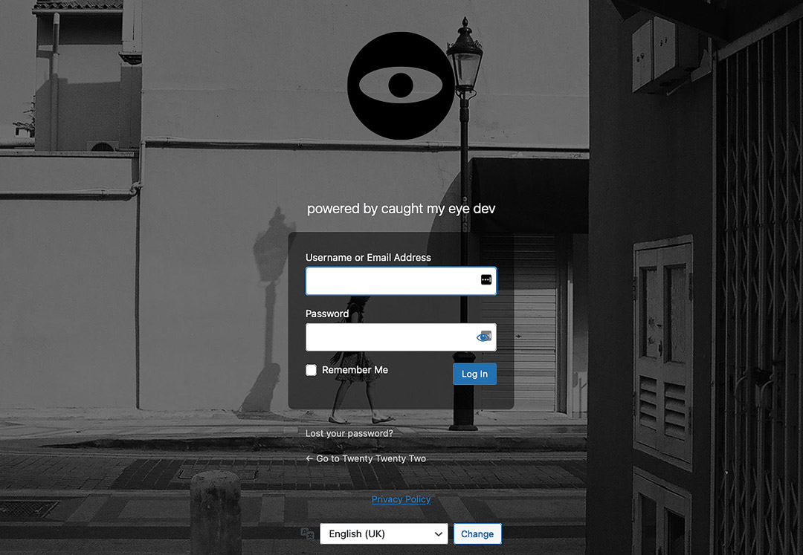

# caught my eye custom login plugin for WordPress

A neumorphic-like custom login page for WordPress.

This plugin will:

1. Adds a background image to the WordPress admin login page.
2. Make the login form's background colour a semi-transparent black.

---

## Installation

1. Upload the **contents** of the plugin zip file to the `/wp-content/plugins/cme-login` directory, or install the plugin through your WordPress plugins page.
1. Activate the plugin through the 'Plugins' page.

---

## Screen captures

---

